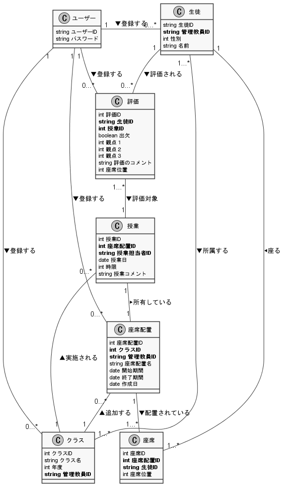

# クラス図

## 改版履歴
|日付|内容|
|:--|:--|
|11/26|初版作成|
|11/29|第2版作成|
|12/3|第3版作成|
|12/6|第4版作成　画像ファイルを更新|
|12/8|第5版作成　画像ファイルを更新。座席配置-授業の多重度を修正|

※太字は外部キーです

各クラスで定義している属性について、外部キーの「管理教員ID」とはユーザーIDのことであるが、生徒・評価・授業などを管理しているユーザーのIDであることを明らかにするためにこのような表記にしている。